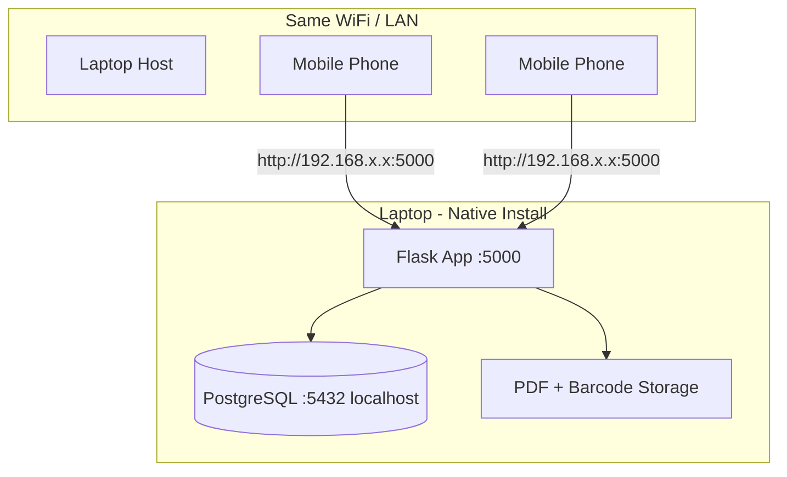
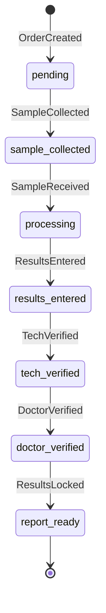

---

name: ClinicLab LAN MVP
overview: Build ClinicLab OS as a single Flask web app with PostgreSQL on the laptop. No Docker, no API — one run.py command starts everything. Users on the same Wi‑Fi open http://:5000 in a mobile browser.
todos:

- id: phase1-scaffold
content: "Phase 1: Flask app, native PostgreSQL, login, roles, seed data, simple LAN run instructions (python run.py)"
status: in_progress
- id: phase2-reception
content: "Phase 2: Patients, visits, test orders, invoices, payments — reception + billing pages (mobile-friendly)"
status: pending
- id: phase3-lab
content: "Phase 3: Samples, barcodes, result entry, range validation, tech/doctor verification"
status: pending
- id: phase4-reports
content: "Phase 4: ReportLab PDFs, reports dashboard, patient history view"
status: pending
- id: phase5-inventory
content: "Phase 5: Inventory items, stock transactions, low-stock/expiry alerts"
status: pending
- id: phase6-compliance
content: "Phase 6: PHC compliance logs (checklists, cleaning, temperature, maintenance, complaints, documents, SOPs)"
status: pending
- id: phase7-hardening
content: "Phase 7: Staff/settings admin, backup/restore, LAN UAT on laptop + mobile devices"
status: pending
isProject: false

---


# ClinicLab OS — Simple Laptop LAN MVP (Flask, No Docker, No API)


## Context

- **Workspace:** `[C:\Users\ahmed\Desktop\ClinicLab](C:\Users\ahmed\Desktop\ClinicLab)` is empty (greenfield).
- **Goal:** Full MVP from your workflow diagram as one simple web application on a laptop; phones on the same network open it in a browser.
- **Constraints:**
  - **No Docker** — native Windows install only.
  - **No separate API** — no REST/JSON layer, no React/Next.js. Flask serves HTML pages directly.
  - **PostgreSQL on the laptop** — not in a container.
  - **Single access point:** `http://<laptop-ip>:5000`
  - **Easy to run** — non-technical staff should start the app with one command.
- **Not in scope:** Cloud hosting, CI/CD, email/WhatsApp integrations.

---


## Why Flask (not Django)


| Criteria                 | Flask                                                          | Django                                  |
| ------------------------ | -------------------------------------------------------------- | --------------------------------------- |
| Simplest to understand   | Small `run.py` you can read top-to-bottom                      | Many folders, framework conventions     |
| Easiest first-time run   | `python run.py` — done                                         | `migrate` + `runserver` + more concepts |
| Every-day run            | Same one command                                               | Same, but more steps on fresh install   |
| Build speed for full MVP | Flask-Admin covers fast CRUD for inventory/compliance/settings | Built-in admin, but heavier scaffold    |


**Decision: Flask** — simplest for users to run and understand; Flask-Admin speeds up back-office CRUD modules.

---


## Target Architecture




**How it works:** Browser requests a URL → Flask route runs Python logic → queries PostgreSQL → returns HTML page. Login uses a session cookie. No JavaScript framework, no API calls.

**Core flow:**
Patient → Visit → Test Order → Sample → Result → Report → Invoice → Payment → Patient History

---


## Tech Stack


| Layer         | Choice                              | Why                                               |
| ------------- | ----------------------------------- | ------------------------------------------------- |
| Web framework | **Flask 3**                         | Minimal, readable, one-file entry point           |
| Templates     | **Jinja2**                          | Built into Flask; server-rendered HTML            |
| UI            | **Bootstrap 5** (CDN)               | Mobile-responsive, no Node.js build step          |
| ORM           | **Flask-SQLAlchemy**                | Simple models, maps to PostgreSQL                 |
| Migrations    | **Flask-Migrate** (Alembic)         | Schema changes via `flask db upgrade`             |
| Auth          | **Flask-Login**                     | Session login, `@login_required`                  |
| Forms         | **Flask-WTF**                       | Form validation + CSRF protection                 |
| Fast CRUD     | **Flask-Admin**                     | Auto admin UI for inventory, compliance, settings |
| Database      | **PostgreSQL 16** (Windows install) | Local only, `localhost:5432`                      |
| PDF           | ReportLab                           | Reports + receipts                                |
| Barcode       | python-barcode + Pillow             | Sample labels                                     |
| Config        | python-dotenv                       | `.env` file for DB password                       |


**Not used:** Docker, FastAPI, Next.js, Django, JWT, CORS, npm/Node.js.

---


## How Users Run It (kept as simple as possible)


### One-time setup (first day)

```powershell
# 1. Install PostgreSQL 16 (Windows installer) — create DB "cliniclab"
# 2. In project folder:
python -m venv venv
.\venv\Scripts\activate
pip install -r requirements.txt

# 3. Copy config and set DB password:
copy .env.example .env
# Edit .env — set DATABASE_URL password

# 4. Create tables + seed data (once only):
python setup.py

# 5. Allow port 5000 in Windows Firewall (once only)
```


### Every day (2 steps)

```powershell
cd C:\Users\ahmed\Desktop\ClinicLab
.\venv\Scripts\activate
python run.py
```

`run.py` prints the LAN URL, e.g.:

```
ClinicLab is running!
  On this laptop:  http://localhost:5000
  On phones:       http://192.168.1.42:5000
Press Ctrl+C to stop.
```

Phones bookmark `http://192.168.1.42:5000` and log in.

PostgreSQL starts automatically with Windows — users never touch it.

---


## Repository Layout (flat and readable)

```
ClinicLab/
├── run.py                  # START HERE — binds 0.0.0.0:5000, prints LAN URL
├── setup.py                # One-time: create tables + seed admin user & test catalog
├── .env.example
├── .env                    # gitignored — DB password
├── requirements.txt
├── README.md               # Simple setup guide with screenshots
│
├── app/
│   ├── __init__.py         # Flask app factory
│   ├── config.py           # Reads .env
│   ├── extensions.py       # db, login_manager, migrate, admin
│   │
│   ├── models/             # SQLAlchemy models (one file per domain)
│   │   ├── patient.py
│   │   ├── laboratory.py
│   │   ├── billing.py
│   │   └── ...
│   │
│   ├── routes/             # URL handlers (return HTML, not JSON)
│   │   ├── auth.py         # /login, /logout
│   │   ├── reception.py    # patients, visits, orders
│   │   ├── lab.py          # samples, results, verification
│   │   ├── billing.py      # invoices, payments
│   │   ├── reports.py      # PDF generation, delivery
│   │   └── dashboard.py    # home page per role
│   │
│   ├── services/           # Business logic (status transitions, audit)
│   ├── forms/              # WTForms form classes
│   ├── templates/          # Jinja2 HTML (Bootstrap, mobile nav)
│   └── utils/              # PDF, barcode, sequence codes
│
├── media/                  # Generated PDFs, barcodes (gitignored)
└── scripts/
    └── backup_db.ps1       # pg_dump helper
```

**Key idea:** `run.py` is ~15 lines. A new user opens one file and understands how the app starts.

---


## PostgreSQL Schema

Same relational design from your workflow diagram — implemented as SQLAlchemy models.

### Core tables

`patients`, `visits`, `test_orders`, `order_items`, `samples`, `result_values`, `reports`, `invoices`, `payments`

### Master data

`tests`, `test_parameters`, `staff`, `users`, `roles`, `role_permissions`, `settings`

### Inventory

`inventory_items`, `stock_transactions`, `suppliers`

### PHC compliance

`daily_checklists`, `cleaning_logs`, `temperature_logs`, `equipment_maintenance`, `complaint_register`, `document_registry`, `sop_documents`

### Cross-cutting

`audit_logs`, `sequences`

**Order status flow** (enforced in `services/order_service.py`):




---


## App Pages (HTML routes — not API)


| URL              | Who uses it      | What it does                                        |
| ---------------- | ---------------- | --------------------------------------------------- |
| `/login`         | Everyone         | Username + password form                            |
| `/`              | Everyone         | Role-based home dashboard                           |
| `/patients`      | Reception        | Search, register, view history                      |
| `/visits/new`    | Reception        | Create visit for patient                            |
| `/orders/new`    | Reception/Doctor | Select tests from dropdown, auto-price              |
| `/samples`       | Lab Tech         | Collection queue, barcode lookup                    |
| `/results/<id>`  | Lab Tech         | Enter parameter values                              |
| `/verify/tech`   | Senior Tech      | Approve results                                     |
| `/verify/doctor` | Doctor           | Final approval + remarks                            |
| `/reports`       | Reports staff    | Generate PDF, mark delivered                        |
| `/invoices`      | Reception        | View invoice, record payment                        |
| `/inventory`     | Inventory mgr    | Stock in/out (or Flask-Admin)                       |
| `/compliance`    | Compliance       | Daily logs (or Flask-Admin)                         |
| `/admin`         | Admin only       | Flask-Admin panel for settings, users, test catalog |


**Flask-Admin** (`/admin`) auto-generates list/add/edit pages for inventory, compliance logs, test catalog, and user management — saves weeks of form-building.

**Patient history:** `/patients/<id>/history` — one HTML page with visits, orders, results, invoices.

---


## RBAC Roles


| Role               | Access                                       |
| ------------------ | -------------------------------------------- |
| Reception          | patients, visits, orders, invoices, payments |
| Lab Technician     | samples, result entry                        |
| Senior Technician  | + technical verification                     |
| Doctor             | order tests, doctor verification             |
| Reports Staff      | PDF generation, delivery                     |
| Inventory Manager  | stock in/out, alerts                         |
| Compliance Officer | PHC logs                                     |
| Admin              | users, settings, `/admin` panel              |


Enforced with `@login_required` + role check decorator on routes; nav links hidden in templates.

---


## Implementation Phases


### Phase 1 — Foundation (Week 1–2)

- Flask app factory, PostgreSQL connection, models for `User`, `Role`, `Staff`, `Setting`, `Sequence`, `AuditLog`
- Login/logout pages (Flask-Login)
- Role-based dashboard shell with mobile bottom nav (Bootstrap)
- `setup.py`: create tables, seed admin user + 8 roles + 20 sample tests
- `run.py` with LAN URL printout
- README with simple setup steps
- **Exit criteria:** `python run.py` → login from phone at `http://<ip>:5000`


### Phase 2 — Reception & Billing (Week 3–4)

- Models: `Patient`, `Visit`, `TestOrder`, `OrderItem`, `Invoice`, `Payment`
- Pages: patient register/search, create visit, order tests, invoice, payment
- Receipt PDF download
- Audit logging
- **Exit criteria:** Patient → Visit → Order → Invoice → Payment on phone


### Phase 3 — Laboratory (Week 5–6)

- Models: `Sample`, `ResultValue`
- Sample collection + barcode label
- Lab queues + result entry + range validation flags
- Tech → doctor verification → lock
- **Exit criteria:** barcode sample through full verification


### Phase 4 — Reports & Patient History (Week 7)

- ReportLab PDF template
- Reports pages + patient history view
- **Exit criteria:** PDF downloadable; history on phone


### Phase 5 — Inventory (Week 8)

- Models + Flask-Admin views for stock management
- Low-stock and expiry alerts on dashboard
- **Exit criteria:** stock issue reduces quantity; alerts show


### Phase 6 — PHC Compliance (Week 9–10)

- Compliance models + Flask-Admin forms
- Export logs as PDF/CSV
- **Exit criteria:** daily logs completable from phone


### Phase 7 — Staff, Settings & Hardening (Week 11–12)

- User/role management via Flask-Admin
- Test catalog editor, org settings
- `backup_db.ps1` script
- UAT on laptop + 2 phones
- **Exit criteria:** full MVP; 3+ LAN devices work

---


## MVP Success Checklist

- Full patient-to-payment flow
- Barcode sample tracking
- Result validation with flags
- Tech + doctor verification
- PDF reports and receipts
- Patient history in one page
- Inventory alerts
- PHC daily logs from phone
- Audit trail
- Role-based access
- `python run.py` **starts everything** — users understand it
- Phones access `http://<laptop-ip>:5000`
- DB backup documented

---


## Risks and Mitigations


| Risk                          | Mitigation                                          |
| ----------------------------- | --------------------------------------------------- |
| Users forget to activate venv | README + optional `start.bat` double-click shortcut |
| Windows firewall blocks port  | Document one-time rule for TCP 5000                 |
| Laptop IP changes             | Static IP or update bookmark                        |
| Flask dev server limits       | Fine for MVP (5–10 users on LAN); note in README    |
| PostgreSQL not running        | README: check Windows Services                      |


### Optional convenience: `start.bat`

```bat
@echo off
cd /d C:\Users\ahmed\Desktop\ClinicLab
call venv\Scripts\activate
python run.py
pause
```

Double-click to start — no terminal knowledge needed.

---


## Recommended First Build Step

After plan approval, build Phase 1:

1. `run.py` + `setup.py` + `requirements.txt`
2. Flask app with login page and role dashboard
3. `.env.example` + README (with `start.bat`)
4. Seed admin user: `admin` / `admin123` (change on first login)

Test: double-click `start.bat` → open phone browser → login works.